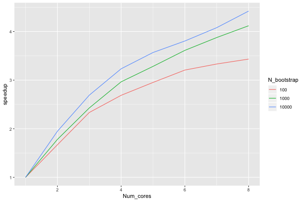
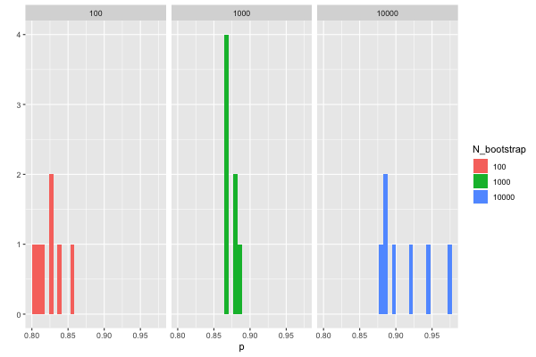

PosteriorBootstrap
[](https://travis-ci.com/alan-turing-institute/PosteriorBootstrap)
[](https://codecov.io/gh/alan-turing-institute/PosteriorBootstrap)
==================

# PosteriorBootstrap

Bayesian learning is built on an assumption that the model space contains a true
reflection of the data generating mechanism. This assumption is problematic,
particularly in complex data environments. By using a Bayesian non-parametric
approach to learning, we no longer have to assume that the model is true.

This package implements a non-parametric statistical model using a parallelised
Monte Carlo sampling scheme. The method implemented in this package allows
non-parameteric inference to be regularized for small sample sizes, while also
being more accurate than approximations such as variational Bayes.

The `concentration` parameter is an effective sample size parameter, determining
the faith we have in the model versus the data. When the concentration is low,
the samples are close to the exact Bayesian logistic regression method; when the
concentration is high, the samples are close to the simplified variational Bayes
logistic regression.

## Installation

You can install from Github with `devtools`:

```r
library("devtools")
install_github("https://github.com/alan-turing-institute/PosteriorBootstrap/")
```

## Example usage

The provided vignette illustrates the use of the package on a logistic
regression model fit to the Statlog German Credit dataset.

## Issues and bug reports

The user discussion and development of strace take place on [Github issues](https://github.com/alan-turing-institute/PosteriorBootstrap/issues).

## Parallelisation

The calculation of the expected speedup depends on the number of bootstrap
samples and the number of processors. It also depends on the system: it is
larger on macOS than on Linux, with some variation depending on the version of
R.

Fixing the number of samples corresponds to [Ahmdal's
law](https://en.wikipedia.org/wiki/Ahmdal's_Law), or the speedup in the task as
a function of the number of processors. The speedup `S_latency` of `N` processors is defined as
the duration of the task with one core divided by the duration of the task with
`N` processors. For the number of bootstrap samples in
100, 1000, and 10,000, the speedup is:



I inverted Ahmdal's law to compute the proportion of the execution time that is
parallelisable from the speedup as:

$$ p = \frac{\frac{1}{S_{latency}}} - 1}{\frac{1}{s} - 1} $$

where $S_{latency}$ is the theoretical speedup of the whole task in Ahmdal's law
and the observed speedup here, and $s$ is the speedup of the part of the task
that can be parallelised, and thus equal to the number of
processors. Calculating this value for the durations from 1 to 8 cores, I got
this plot:



The proportion of the code that can be parallelised is high, and higher the
large the bootstrap samples, and always below 1. For large samples with
`n_bootstrap = 10,000`, one estimate of proportion is close to 100%.


