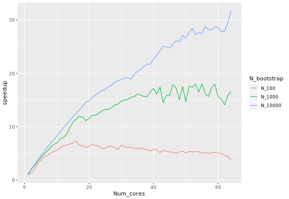
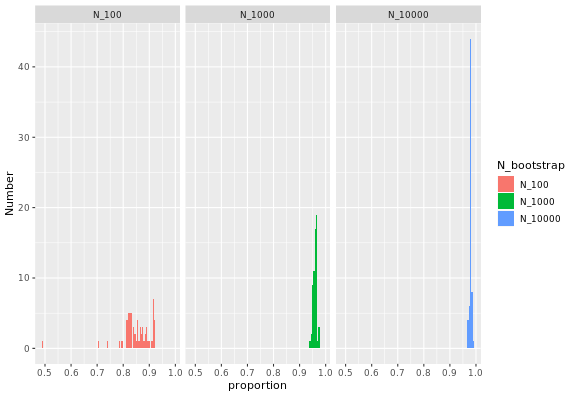

# PosteriorBootstrap
[](https://www.repostatus.org/#inactive)
[](https://cran.r-project.org/package=PosteriorBootstrap)
[](https://www.r-pkg.org/pkg/PosteriorBootstrap)
[](https://github.com/alan-turing-institute/PosteriorBootstrap/actions)
[](https://codecov.io/gh/alan-turing-institute/PosteriorBootstrap)

Bayesian learning is built on an assumption that the model space contains a true
reflection of the data generating mechanism. This assumption can be problematic
in complex data environments. By using a Bayesian non-parametric approach to
learning, we no longer have to assume that the model is true.

This package implements a non-parametric statistical model using a parallelised
Monte Carlo sampling scheme. The method implemented in this package allows
non-parametric inference to be regularized for small sample sizes, while also
being more accurate than approximations such as variational Bayes.

The concentration parameter is an effective sample size parameter, determining
the faith we have in the model versus the data. When the concentration is low,
the samples are close to the exact Bayesian logistic regression method; when the
concentration is high, the samples are close to the simplified variational Bayes
logistic regression.

## Installation
This package is available on CRAN. The latest release can be installed using

```r
install.packages("PosteriorBootstrap")
```

If you prefer to use the bleeding edge version, you can install from Github with `devtools`:

```r
requireNamespace("devtools", quietly = TRUE)
devtools::install_github("https://github.com/alan-turing-institute/PosteriorBootstrap/")
```

## Example usage and graphical result from the paper

Please see the provided vignette (at
[`vignettes/PosteriorBootstrap.Rmd`](https://github.com/alan-turing-institute/PosteriorBootstrap/blob/master/vignettes/PosteriorBootstrap.Rmd))
for an example usage of the package to fit a logistic regression model to the
Statlog German Credit dataset.

The vignette reproduces Figure 2, page 8, from Lyddon, Walker, and Holmes
(2018), "Nonparametric learning from Bayesian models with randomized objective
functions" (32nd Conference on Neural Information Processing Systems, Montréal,
Canada). The vignette is limited to a concentration parameter of `c = 500` and
the figure below reproduces the one from the paper with the same concentration
parameters.


The figure above shows the advantage of the package: one can tune the proximity
of the sampling method to exact inference (Bayesian logistic regression) with a
low `c` or to approximate inference (variational inference) with high `c`, or
anywhere in between. As mentioned in page 3 of the paper, the concentration
parameter `c` is an effective sample size, governing the trust we have in the
parametric model.

## Issues and bug reports

For any bug reports or feature requests, please open an [issue on Github](https://github.com/alan-turing-institute/PosteriorBootstrap/issues).

## Parallelisation

The calculation of the expected speedup depends on the number of bootstrap
samples and the number of processors. It also depends on the system: it is
larger on macOS than on Linux, with some variation depending on the version of
R. **Please note that parallelisation is currently unsupported on Windows**.

Fixing the number of samples corresponds to [Ahmdal's
law](https://en.wikipedia.org/wiki/Ahmdal's_Law), or the speedup in the task as
a function of the number of processors. The speedup `S_latency` of `N` processors
is defined as the duration of the task with one core divided by the duration of
the task with `N` processors. When using 100, 1000 and 10000 samples, the following
speed-ups were observed:



Inverting Ahmdal's law gives the proportion of the execution time that is
parallelisable from the speedup:


where `S_latency` is the execution speedup for the whole task (as defined above), and `s` is the
speedup for the part of the task that can be parallelised. In this case, `s` is simply equal to the
number of cores used, so repeatedly measuring `S_latency` for several choices of number of cores
gives this plot:



The proportion of the code that can be parallelised is high, and higher the
large the bootstrap samples, and always below 1. For large samples with
`n_bootstrap = 10000`, the values are close to 100%.


## Reproducing the results on Azure

To run the results in this section automatically, you'll need a [Microsoft Azure
subscription](https://azure.microsoft.com/en-gb/) (one of the [free
subscriptions](https://azure.microsoft.com/en-gb/free/) for example) and the
[Azure Command-Line
Interface (CLI)](https://docs.microsoft.com/en-us/cli/azure/install-azure-cli-macos?view=azure-cli-latest).
You will need to login to your Azure account with the Azure CLI:

```bash
az login
```

then follow the instructions. You will need to create a resource group on
[portal.azure.com](https://portal.azure.com/) and make note of the name of the
resource group. The default name of the resource group is `PB` for PosteriorBootstrap.

Then run the following on a shell with current directory at the root of the
repository for deploying on a new machine:

```bash
azure/deploy.sh -g=<name of resource group> -k=<path to your private key>
```

or, to deploy on an existing machine:

```bash
azure/deploy.sh -i=<IP address> -g=<name of resource group> -k=<path to your private key>
```

The path to your private key defaults to `~/.ssh/azure` if you do not specify
it, and the public key is that path with the suffix `.pub`.

If you need to generate a private-public key pair, run:

```bash
ssh-keygen -t rsa -b 4096 -f ~/.ssh/azure
```

